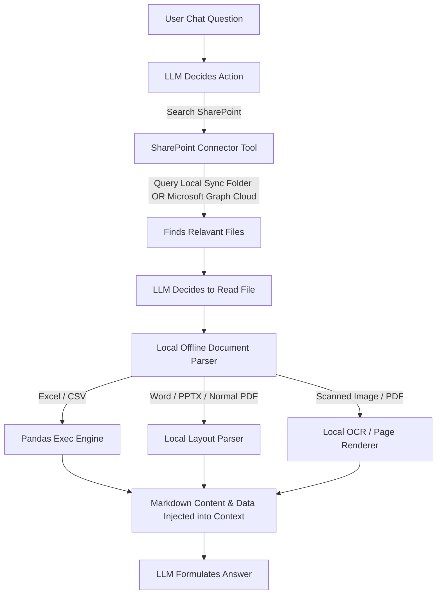

# Blueprint for Offline Local & SharePoint Document Intelligence in Open WebUI

Standard chunk-and-embed RAG systems (vectorization) fail on complex corporate documents (such as diverse SharePoint libraries) because they strip away layout geometry, destroy spreadsheet grid structures, and skip visual details.

To achieve a highly reliable, **100% local, offline-capable** "Chat with Docs" system within **Open WebUI** that retrieves data directly from SharePoint, use the following multi-pronged architecture:

---

## 1. The Architecture



---

## 2. Document Processing Strategies (Local & Offline)

*   **Excel and CSV Files:** Handled via a **Local Pandas execution engine** instead of semantic vector search. This guarantees 100% mathematical accuracy on financial tables. **Multi-sheet Excels are fully managed:** if a file has multiple sheets, the tool exposes them as a dictionary of DataFrames (`sheets`) allowing cross-sheet calculations (e.g. joining or summing metrics across sheets). It also provides a schema discovery method so the LLM can inspect sheet names and columns before writing code.
*   **Word, PDF, & PowerPoint Files:** Handled via custom offline python parsers (`pdfplumber`, `python-docx`, `python-pptx`) to parse layout, paragraphs, and tables sequentially and reconstruct them as **Markdown tables**.
*   **Scanned Images:** Handled via **Tesseract OCR** locally to extract text without cloud internet requests.
*   **SharePoint Integration:**
    1.  **Local Folder Sync (Recommended):** If you sync SharePoint folders to this computer using OneDrive/SharePoint Sync client, the tool searches and parses files directly from your disk locally.
    2.  **Microsoft Graph Cloud API:** If you connect directly to the SharePoint cloud on the fly, the tool authenticates using Azure AD Client credentials (stored in Open WebUI Valves), downloads the document to a local temp folder, runs the local offline parser, and cleans up.

---

## 3. Deployment Directory Structure

The files have been copied to your working directory:
```
/home/hirthikbalaji/AGPT_FE/Brain/
├── open_webui_document_intelligence_guide.md  <-- This Guide
├── test_local_parser.py                       <-- Test runner containing validation tests
├── sample_data/                               <-- Programmatically generated sample files
│   ├── sales.xlsx
│   ├── multisheet.xlsx                        <-- Multi-sheet Excel workbook sample
│   ├── contract.docx
│   ├── slides.pptx
│   └── report.pdf
└── open_webui_tools/
    ├── local_document_parser.py               <-- Main offline parsing engine
    ├── spreadsheet_query.py                   <-- Local spreadsheet analyzer
    ├── pdf_page_renderer.py                   <-- Local scanned PDF image renderer
    └── sharepoint_connector.py                <-- SharePoint directory connector
```

---

## 4. How to Test the Setup Locally

Run the validation suite that programmatically generates sample data and parses them offline:
```bash
python3 test_local_parser.py
```
This test script verifies that tables, headings, PowerPoint grids, and Excel pandas calculations are extracted cleanly.

---

## 5. Deployment Instructions for Open WebUI

### Step 1: Install System Dependencies
Make sure you install the local OCR package on the machine running Open WebUI (required for scanned PDF/images):
*   **Ubuntu/Linux:** `sudo apt-get install tesseract-ocr`
*   **macOS:** `brew install tesseract`

### Step 2: Add Custom Workspace Tools in Open WebUI
1.  Go to **Workspace > Tools** in your Open WebUI dashboard.
2.  Click **Create Tool** and paste the code from:
    *   [local_document_parser.py](file:///home/hirthikbalaji/AGPT_FE/Brain/open_webui_tools/local_document_parser.py)
    *   [spreadsheet_query.py](file:///home/hirthikbalaji/AGPT_FE/Brain/open_webui_tools/spreadsheet_query.py)
    *   [sharepoint_connector.py](file:///home/hirthikbalaji/AGPT_FE/Brain/open_webui_tools/sharepoint_connector.py)
3.  Save the tools.

### Step 3: Configure SharePoint Connection (Valves)
For the **SharePoint Connector** tool, click its settings/valves icon:
*   **Local Setup:** Enter the absolute path to your synced SharePoint/OneDrive directory in `SHAREPOINT_LOCAL_PATH` (e.g. `/home/user/OneDrive - Company`).
*   **Cloud API Setup:** If you don't sync locally, enter your Azure Active Directory details in `TENANT_ID`, `CLIENT_ID`, `CLIENT_SECRET`, and `SITE_ID`.
*   **User Access Controls:** To restrict this tool to specific users, enter a comma-separated list of their Open WebUI account email addresses in `AUTHORIZED_EMAILS` (e.g., `alice@company.com, bob@company.com`). If left blank, all chat users can access the tool. Open WebUI administrators always bypass this check.

### Step 4: Enable on Models
Go to **Workspace > Models**, edit your local LLM (e.g. via Ollama), and toggle **on** the tools under the model's capabilities.
Now, when you ask your model about files inside your SharePoint library, the model will run search queries and parse documents completely on your local computer.
