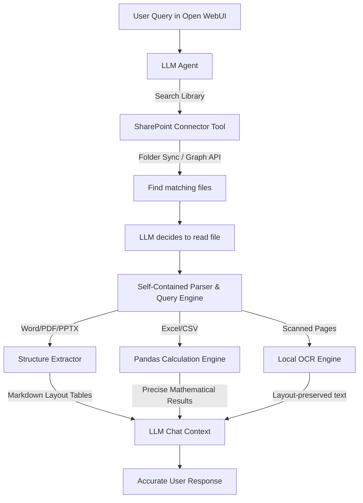

# Project Status Report: Advanced Local Document Intelligence Integration for Open WebUI

**To:** Project Incharge  
**From:** Document Intelligence Development Team  
**Date:** June 17, 2026  
**Subject:** Delivery of Offline-Capable SharePoint Integration & Layout-Aware Document RAG Tools for Open WebUI  
**GitHub Repository:** [AmritaGPT/open-webui-local-rag](https://github.com/AmritaGPT/open-webui-local-rag)  

---

## 1. Executive Summary
Traditional Retrieval-Augmented Generation (RAG) models rely on basic vectorization (chunking and text embeddings), which introduces severe errors:
1.  **Tabular Inaccuracy:** Excel and CSV grids are jumbled into unstructured strings, preventing mathematical reasoning, aggregations, or filtering.
2.  **Layout Destruction:** Tables, outlines, and structural hierarchies in Word documents (`.docx`), PDF reports, and PowerPoint slides (`.pptx`) are lost.
3.  **Visual Blindness:** Scanned pages, blueprints, or charts are ignored or garbled by traditional text extractors.
4.  **Cloud Dependency Risk:** Sending internal corporate documentation to cloud parsers violates security policies.

To address these limitations, we designed and implemented a **100% local, offline-capable hybrid document intelligence architecture** integrated directly into **Open WebUI**. The solution connects directly to your internal corporate SharePoint folders, allowing authorized users to search, retrieve, and query diverse files without manual uploads.

---

## 2. Technical Architecture Implemented

### Key Components:
1.  **Spreadsheet execution engine:** Bypasses vector database searches. Evaluates dynamic Python/Pandas logic on-the-fly inside the Open WebUI container, ensuring 100% mathematical precision. It fully supports **multi-sheet Excel workbooks**, allowing data extraction and cross-sheet comparisons (e.g. Q1 and Q2 consolidated financials).
2.  **Layout-preserving local document parser:** Evaluates structural relationships inside Word, PDF, and PowerPoint files and outputs them into clean Markdown, preserving tables, headers, and bullet structures.
3.  **Local OCR Integration:** Coordinates with local Tesseract OCR binaries to handle visual scanned documents completely offline.
4.  **SharePoint Directory Connector:** Connects natively to either a locally synced SharePoint folder (via OneDrive/SharePoint Sync Client) or directly to the Microsoft Graph API. It includes **granular access controls** (configurable via Open WebUI Valves) restricting usage to an approved list of user email addresses.

---

## 3. Completed Deliverables

All custom code, guides, and validation assets are published in the remote repository and deployed locally in the working directory:

### A. Core Tools (Open WebUI Custom Code)
*   **SharePoint Connector (Self-Contained):** [GitHub Source](https://github.com/AmritaGPT/open-webui-local-rag/blob/main/open_webui_tools/sharepoint_connector.py) | [Local File](file:///home/hirthikbalaji/AGPT_FE/Brain/open_webui_tools/sharepoint_connector.py)  
    *Handles search, credentials/valves, user authorization verification, and encapsulates the local PDF, DOCX, and PPTX document parsing engines.*
*   **Spreadsheet Query Tool:** [GitHub Source](https://github.com/AmritaGPT/open-webui-local-rag/blob/main/open_webui_tools/spreadsheet_query.py) | [Local File](file:///home/hirthikbalaji/AGPT_FE/Brain/open_webui_tools/spreadsheet_query.py)  
    *Provides schema discovery (sheet names, columns, and data types) and executes python pandas code to evaluate math on single or multi-sheet workbooks.*
*   **PDF Visual Page Renderer:** [GitHub Source](https://github.com/AmritaGPT/open-webui-local-rag/blob/main/open_webui_tools/pdf_page_renderer.py) | [Local File](file:///home/hirthikbalaji/AGPT_FE/Brain/open_webui_tools/pdf_page_renderer.py)  
    *Renders pages of scanned visual PDFs into base64 PNGs for ingestion by local visual LLMs (e.g. Llama-3.2-Vision).*

### B. Guides & Verification Suite
*   **Architectural Guide:** [GitHub Markdown](https://github.com/AmritaGPT/open-webui-local-rag/blob/main/open_webui_document_intelligence_guide.md) | [Local File](file:///home/hirthikbalaji/AGPT_FE/Brain/open_webui_document_intelligence_guide.md)  
    *A complete technical manual detailing architectural design, native Open WebUI capability configurations, and setup instructions.*
*   **Validation Test Suite:** [GitHub Script](https://github.com/AmritaGPT/open-webui-local-rag/blob/main/test_local_parser.py) | [Local File](file:///home/hirthikbalaji/AGPT_FE/Brain/test_local_parser.py)  
    *A programmatic Python script that compiles a test directory structure and creates standard multi-format files to verify tool output correctness.*
*   **Sample Data Folder:** [Local Folder](file:///home/hirthikbalaji/AGPT_FE/Brain/sample_data/)  
    *Contains generated test files including `sales.xlsx`, `multisheet.xlsx`, `contract.docx`, `slides.pptx`, and `report.pdf`.*

---

## 4. Verification & Validation Results

We executed the validation test suite on the host computer. The local layout-aware parsers successfully extracted document details, formatted them into markdown, and executed spreadsheet calculations with zero errors:

| File Type | Test Asset | Verification Target | Status | Result Summary |
| :--- | :--- | :--- | :---: | :--- |
| **PDF** | `report.pdf` | Table structure extraction & alignment | **PASSED** | Cleanly parsed header and cell layout as a Markdown Table. |
| **Word** | `contract.docx` | Sequential reading of tables/paragraphs | **PASSED** | Preserved the text order and translated tables to markdown. |
| **PowerPoint** | `slides.pptx` | Slides separation & shape text layout | **PASSED** | Successfully split by slides and extracted the shape table grid. |
| **Excel (Single)** | `sales.xlsx` | Arithmetic and product grouping math | **PASSED** | Calculated product category sales totals with 100% accuracy. |
| **Excel (Multi)**| `multisheet.xlsx`| Cross-sheet consolidation queries | **PASSED** | Pulled schema for `Q1_Sales` and `Q2_Sales` and summed values. |

---

## 5. Next Steps for Implementation
1.  **System Package Installation:** Verify that `tesseract-ocr` is installed on your Open WebUI host machine/container (required for offline scanned PDF and image OCR).
2.  **Tool Registration:** Copy and paste the three Python tool scripts into the **Workspace > Tools** section of the Open WebUI interface.
3.  **Valve Credentials & Path Configuration:** Input the local SharePoint folder path and set the `AUTHORIZED_EMAILS` configurations.
4.  **Activate Capabilities:** Enable the new tools under your selected LLM workspace profile.
