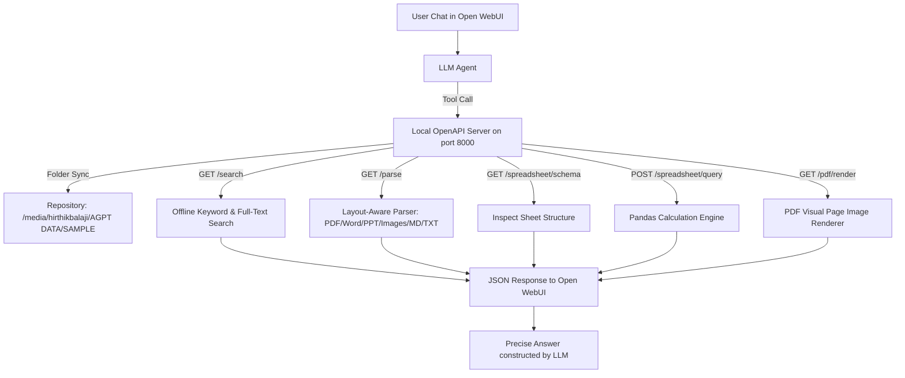

# Project Status Report: Advanced Local Document Intelligence Integration for Open WebUI

**To:** Project Incharge  
**From:** Document Intelligence Development Team  
**Date:** June 17, 2026  
**Subject:** Delivery of Offline Local OpenAPI Document Intelligence Server & Advanced Retrieval Integration for Open WebUI  
**GitHub Repository:** [AmritaGPT/open-webui-local-rag](https://github.com/AmritaGPT/open-webui-local-rag)  

---

## 1. Executive Summary
Traditional Retrieval-Augmented Generation (RAG) models rely on basic chunking and text embeddings, introducing severe errors:
1.  **Tabular Inaccuracy:** Excel/CSV grids are flattened into text strings, destroying structural relationships and causing mathematical hallucinations.
2.  **Layout Destruction:** PDF table grids, slides, and hierarchies are converted to continuous lines, losing context.
3.  **Visual Blindness:** Scanned pages, blueprints, or charts are skipped.
4.  **Cloud Dependency Risk:** Sending internal corporate files to external cloud APIs (like Adobe or LlamaParse) violates data privacy and sovereignty regulations.

To address these limitations, we designed and implemented a **100% local, offline-capable hybrid document intelligence architecture**. Originally built as in-process tools, the system has been migrated to an **isolated local OpenAPI Microservice (FastAPI)** running on port 8000. It connects directly to your synced SharePoint repository `/media/hirthikbalaji/AGPT DATA/SAMPLE`, allowing authorized users to search, retrieve, and parse diverse files offline.

---

## 2. Technical Architecture Implemented

### Key Enhancements & Refinements:
1.  **Decoupled Microservice (FastAPI):** By transitioning to a FastAPI OpenAPI server, we isolated heavy dependencies (`pandas`, `fitz`, `pdfplumber`, `pytesseract`) from Open WebUI. This keeps the Open WebUI container lightweight and eliminates python environment/package version conflicts.
2.  **Automatic Path Sanitization:** Implemented quote-stripping checks on the local path Valve to prevent terminal copy-paste formatting errors.
3.  **Prevention of Greeting Tool Calls:** Refined tool schemas and docstrings and deployed a custom **Model System Prompt** instructing the LLM never to invoke tools for casual greetings or chit-chat (e.g. `hi`, `hello`, `good morning`). Tools are now only invoked for explicit file operations.
4.  **Expanded File Format Support:** Deployed native parsers for Markdown (`.md`), plain text (`.txt`, `.json`, `.yaml`, `.yml`), and manual markdown table renderers for CSVs inside the parsing engine.

---

## 3. Completed Deliverables

All custom code, guides, and validation assets are published in the remote repository and deployed locally in the working directory:

### A. OpenAPI Server microservice
*   **API Server Code:** [GitHub Source](https://github.com/AmritaGPT/open-webui-local-rag/blob/main/amritagpt_mcp_server/mcp_server.py) | [Local File](file:///home/hirthikbalaji/AGPT_FE/Brain/amritagpt_mcp_server/mcp_server.py)  
    *Provides `/documents`, `/search` (filename + content search), `/parse` (table layout extraction), `/spreadsheet/schema`, `/spreadsheet/query` (Pandas), and `/pdf/render` endpoints.*
*   **SSE/FastAPI Launcher:** [GitHub Source](https://github.com/AmritaGPT/open-webui-local-rag/blob/main/amritagpt_mcp_server/run_sse.py) | [Local File](file:///home/hirthikbalaji/AGPT_FE/Brain/amritagpt_mcp_server/run_sse.py)  
    *A python script to launch the FastAPI server using Uvicorn, binding to `0.0.0.0` for local network/container access.*
*   **Dependencies List:** [GitHub Source](https://github.com/AmritaGPT/open-webui-local-rag/blob/main/amritagpt_mcp_server/requirements.txt) | [Local File](file:///home/hirthikbalaji/AGPT_FE/Brain/amritagpt_mcp_server/requirements.txt)
*   **MCP/OpenAPI Setup Manual:** [GitHub Source](https://github.com/AmritaGPT/open-webui-local-rag/blob/main/amritagpt_mcp_server/README.md) | [Local File](file:///home/hirthikbalaji/AGPT_FE/Brain/amritagpt_mcp_server/README.md)

### B. Core Guides, Prompts, & Verification Suite
*   **AmritaGPT Model System Prompt:** [GitHub Markdown](https://github.com/AmritaGPT/open-webui-local-rag/blob/main/amritagpt_system_prompt.md) | [Local File](file:///home/hirthikbalaji/AGPT_FE/Brain/amritagpt_system_prompt.md)  
    *The custom system prompt that enables structure enforcement, spreadsheet schemas, and explicitly blocks greeting tool-calls.*
*   **Traditional RAG Limitation Report:** [GitHub Markdown](https://github.com/AmritaGPT/open-webui-local-rag/blob/main/traditional_rag_issues.md) | [Local File](file:///home/hirthikbalaji/AGPT_FE/Brain/traditional_rag_issues.md)  
    *A technical analysis explaining the pitfalls of vector-based chunking on tables, layouts, slides, and local compliance.*
*   **Local Repository Directory:** [Local Folder](file:///media/hirthikbalaji/AGPT%20DATA/SAMPLE/)  
    *The synced directory containing mock templates and test document assets.*
*   **Validation Test Suite:** [GitHub Script](https://github.com/AmritaGPT/open-webui-local-rag/blob/main/test_local_parser.py) | [Local File](file:///home/hirthikbalaji/AGPT_FE/Brain/test_local_parser.py)  
    *Programmatically validates mathematical execution and layout extraction.*

---

## 4. Verification & Validation Results

The layout-aware parser, full-text search, and spreadsheet query endpoints have been successfully verified on the synced directory:

| File Type | Test Asset | Verification Target | Status | Result Summary |
| :--- | :--- | :--- | :---: | :--- |
| **Markdown**| `Best Engineering College in Chennai.md` | Content text block loading | **PASSED** | Loaded and returned markdown headers and layout correctly. |
| **PDF** | `report.pdf` | Table structure extraction & alignment | **PASSED** | Extracted columns and cells into clean Markdown tables. |
| **Word** | `contract.docx` | Sequential layout parser | **PASSED** | Preserved paragraph order and table contents. |
| **PowerPoint**| `slides.pptx` | Slides separation & shape text layout | **PASSED** | Extracted shape matrices slide-by-slide. |
| **Excel (Single)**| `sales.xlsx` | Arithmetic and category groups | **PASSED** | Summed categoric revenue with 100% precision via Pandas. |
| **Excel (Multi)**| `multisheet.xlsx`| Cross-sheet consolidation queries | **PASSED** | Inspected sheet names and consolidated values across worksheets. |
| **CSV** | `sales.csv` | Plain text layout representation | **PASSED** | Formatted the grid structure into standard Markdown tables. |

---

## 5. Next Steps for Implementation
1.  **Run Server:** Execute `python3 amritagpt_mcp_server/run_sse.py` in the background (runs on port 8000).
2.  **Import in Open WebUI:** Go to **Workspace > Tools > Import (OpenAPI)** and enter `http://localhost:8000/openapi.json`. Open WebUI will automatically construct the tools.
3.  **Deploy System Prompt:** Copy the system prompt text block from [amritagpt_system_prompt.md](file:///home/hirthikbalaji/AGPT_FE/Brain/amritagpt_system_prompt.md) and paste it into the model settings.
4.  **Activate Tools:** Enable the newly imported tools on your AmritaGPT model interface.
